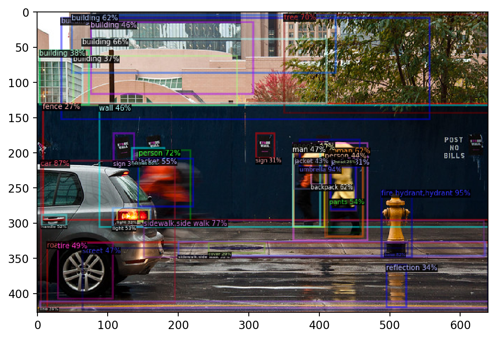
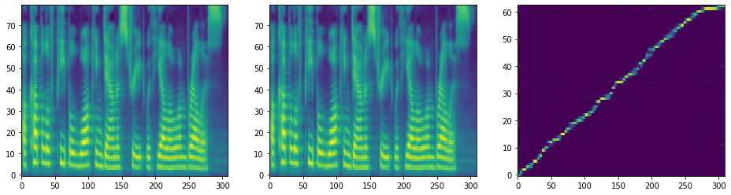

# bertron

bertron is a project to create an end to end neural network which can analyze an image and describe it in a natural human voice. Please run the jupyter notebook for a demo: [BertronDemo](BertronDemo.ipynb)



'A couple of people walking down a street with yellow umbrellas.'



## Installation

### Requirements
- An NVIDIA GPU
- Linux (Tested on Ubuntu 18.04)
- Cuda Drivers
- gcc & g++ ≥ 4.9
- Python
- PyTorch, torchvision, and cudatoolkit
- matplotlib
- requests
- validators
- cython
- OpenCV
- pycocotools
- boto3
- detectron2
- apex
- pycocoevalcap (for evaluation)
- jupyter (to run the notebook)

### Steps (Conda highly recommended)

Please install Cuda Drivers appropriate for your GPU setup: https://docs.nvidia.com/cuda/cuda-installation-guide-linux/index.html

Install gcc if you don't have it (gcc --version):
```
sudo apt install gcc
```

Create a conda environmnet:
```
conda create -n bertron python
```

Enter your new environment:
```
conda activate bertron
```

Install pytorch, torchvision, and cudatoolkit
```
conda install pytorch torchvision cudatoolkit=10.1 -c pytorch
```

Install the rest available through conda:
```
conda install matplotlib requests boto3 jupyter
```

Install opencv
```
conda install -c conda-forge opencv
```

Install the rest available through pip:
```
pip install validators cython
```

Install pycocotools:
```
pip install 'git+https://github.com/cocodataset/cocoapi.git#subdirectory=PythonAPI'
```

Install pycocoevalcap (for evaluation):
```
pip install git+https://github.com/flauted/coco-caption.git@python23
```

Clone this repo recursively along with the submodules if you haven't already:
```
git clone --recurse-submodules https://github.com/pkyIntelligence/bertron.git
```

Install this version of detectron2
```
cd bertron/detectron2
pip install -e .
cd ../..
```

Install apex
```
git clone https://github.com/NVIDIA/apex
cd apex
pip install -v --no-cache-dir --global-option="--pyprof" --global-option="--cpp_ext" --global-option="--cuda_ext" ./
cd ..
```

Download pretrained model weights (1.7 GB Total)
```
cd bertron
wget -O e2e_faster_rcnn_X-101-64x4d-FPN_2x-vlp.pkl "https://onedrive.live.com/download?cid=E5364FD183A1F5BB&resid=E5364FD183A1F5BB%212014&authkey=AAHgqN3Y-LXcBvU"
wget -O coco_g4_lr1e-6_batch64_scst.tar.gz "https://onedrive.live.com/download?cid=E5364FD183A1F5BB&resid=E5364FD183A1F5BB%212027&authkey=ACM1UXlFxgfWyt0"
```

Move weights and clean up
```
mv e2e_faster_rcnn_X-101-64x4d-FPN_2x-vlp.pkl model_weights/detectron
tar -xf coco_g4_lr1e-6_batch64_scst.tar.gz
mv coco_g4_lr1e-6_batch64_scst/model.19.bin model_weights/bert
rm -rf coco_g4_lr1e-6_batch64_scst*
```

### Done!!!

## Validation

### Data Setup

In order to validate we need validation data, we will be using Karpathy's split on COCO for validation.
I recommend having a central location for your data, mine is ~/Datasets, so all my coco data will be in ~/Datasets/coco, these steps assume you are in this folder.
Grab the data/annotations (38 GB Total):
```
wget http://images.cocodataset.org/zips/train2014.zip
wget http://images.cocodataset.org/zips/val2014.zip
wget http://images.cocodataset.org/zips/test2014.zip
wget http://images.cocodataset.org/zips/test2015.zip

wget http://images.cocodataset.org/annotations/annotations_trainval2014.zip
wget http://images.cocodataset.org/annotations/image_info_test2014.zip
wget http://images.cocodataset.org/annotations/image_info_test2015.zip

wget https://cs.stanford.edu/people/karpathy/deepimagesent/caption_datasets.zip
```

unzip the files
```
unzip '*.zip'
```

move the Karpathy split definition to annotations, you may delete the flickr ones for now, leaving them will do no harm:
```
mv dataset_coco.json annotations
rm dataset_flickr*  # optional
```

The list of coco images specifically for validation under the Karpathy split is included within this repository under coco/annotations/coco_valid_jpgs.json, copy it to the coco annotations folder:
```
export BERTRON_ROOT=~/git/bertron  # Change as appropriate for your setup
cp $BERTRON_ROOT/coco/annotations/coco_valid_jpgs.json annotations
```

Optionally, clean up the remaining zip files if you need the space
```
rm *.zip
```

That's it, assuming installation was also done correctly, activate the environment you installed bertron to, go to your bertron root and run the validate_coco_captions.py script (Takes about 30 minutes on an GeForce RTX 2080 Ti):
```
conda activate bertron

cd $BERTRON_ROOT
python validate_coco_captions.py \
    --detector_config detectron2/configs/COCO-Detection/faster_rcnn_X_101_64x4d_FPN_2x_vlp.yaml \
    --detector_weights model_weights/detectron/e2e_faster_rcnn_X-101-64x4d-FPN_2x-vlp.pkl \
    --decoder_config VLP/configs/bert_for_captioning.json \
    --decoder_weights model_weights/bert/model.19.bin \
    --object_vocab vocab/objects_vocab.txt \
    --coco_root ~/Datasets/coco \  # Change to your coco root as approriate
    --coco_data_info annotations/dataset_coco.json \
    --coco_ann_file annotations/captions_val2014.json \
    --valid_jpgs_file annotations/coco_valid_jpgs.json \
    --batch_size 4 \  # The model is quite large for GPU RAM, you may need to reduce if you run out of memory
    --dl_workers 4  # Should at least be the number of cores your CPU has, if GPU util < 100%, try increasing
```

results are saved under $BERTRON_ROOT/eval_results/0_val.json

Current results with these weights are:
|        | BLEU 1 | BLEU 2 | BLEU 3 | BLEU 4 | METEOR | ROUGE_L | CIDEr | SPICE |
| ------ | ------ | ------ | ------ | ------ | ------ | ------- | ----- | ----- |
|Scores: | 0.654  | 0.478  | 0.338  | 0.237  | 0.230  | 0.494   | 0.763 | 0.159 |


## Acknowledgement
- Pretrained weights and most code started with https://github.com/LuoweiZhou/VLP
- Detectron2 for detector base: https://github.com/facebookresearch/detectron2
- Tacotron2 for pretrained weights and tts: https://github.com/NVIDIA/tacotron2
- Bottom-Up Top-Down Attention for general architecture and vocab: https://github.com/peteanderson80/bottom-up-attention
- bert and transformers: https://github.com/huggingface/transformers

And of course all the open source code and research that these all are built on as well.
